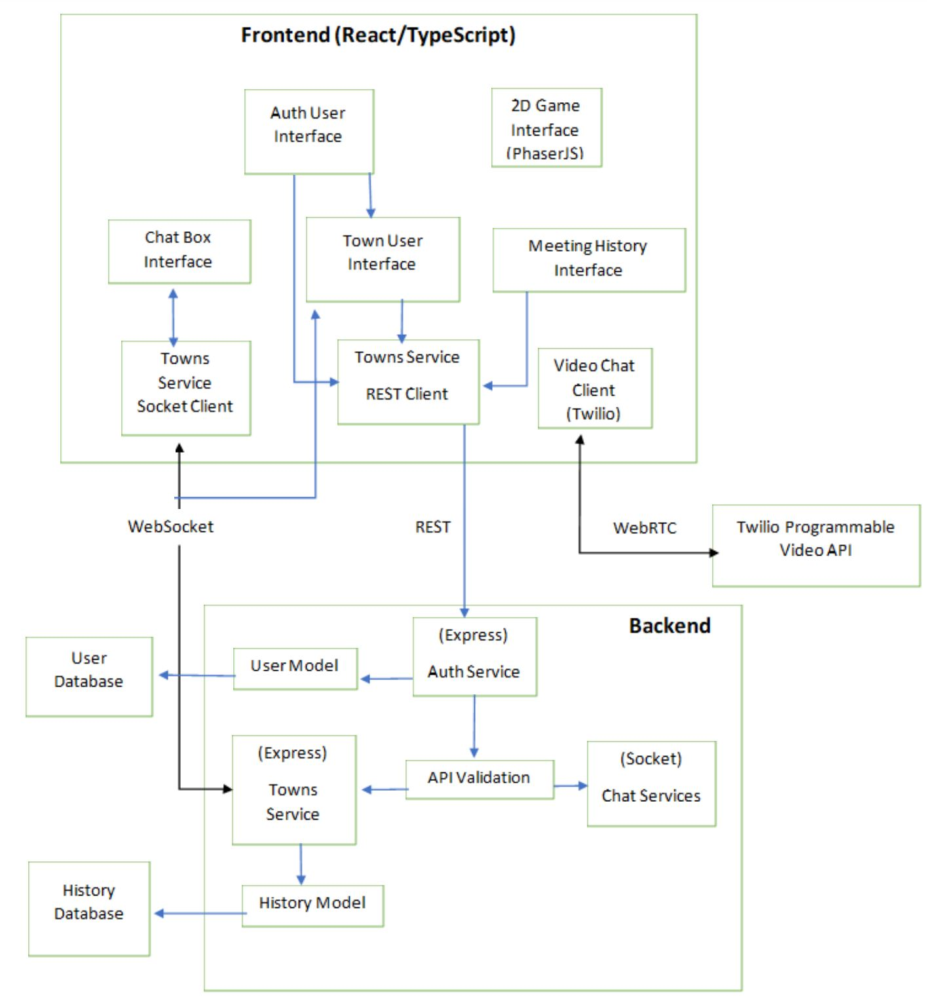

# Design

## Description of changes to the exisiting Covey.Town codebase

### Frontend

#### New Components

    Following components were added in the frontend  folder - frontend\src\components:

    a) Home\Home.tsx
    b) ChatBox\ChatWindow.tsx

    The Home.tsx was developed to create a home page with description of the application to let the user understand the scope of it. It has Sign In and Sign Up buttons to let the users create an account and log in to the application using the credentials. This covers parts of the first and second user story as explained in the FEATURE.md.

    The ChatWindow.tsx was developed to let the users text chat with other users in the town. The ChatWindow has an option to either send public message to all the users of the town or a private message to a single user. This covers third and fourth user story as explained in the FEATURE.md

#### Changes to existing components

    Following existing components were edited in the frontend folder - frontend\src\components:

    a) CoveyTypes.ts
    b) App.tsx
    c) Login\Login.tsx
    d) Login\TownSelection.tsx
    e) classes\TownServiceClient.ts

    The CoveyAppState in the CoveyTypes.ts was modified to include emailId of the user as a part of the state.

    The App.tsx contains the logic of rendering pages based on different condition. Two new CoveyAppUpdate was included - playerLoggedIn and playerLoggedOut to handle the login and logout feature. AppStateReducer was modified to include the CoveyAppUpdate. SessionStorage was added to handle the states on page refresh LoginHandler and LogoutHandler was added to render different pages on login and logout. UseMemo was modified to incorporate home page and changes were made to the conditions to render the pages.

    The Login.tsx was modified to add a menu dropdown which has three functionalites - Profile, Meeting History and Logout which are the remaining parts of the first and second user stories as explained in the FEATURE.md

    The TownSelection.tsx was modified for format changes.

    The TownServiceClient.ts was modified to include services like - loginUser(), logoutUser(), registerUser(), fetchLogs(), updateProfile(), deleteProfile() for the first and second user stories as explained in the FEATURE.md

### Services

#### New Components

    Following components were added in the services folder - services\roomService:

#### Changes to existing components

    Following existing components were edited in the services folder - services\roomService:

## Architecture of the new code

## CRC Diagram

