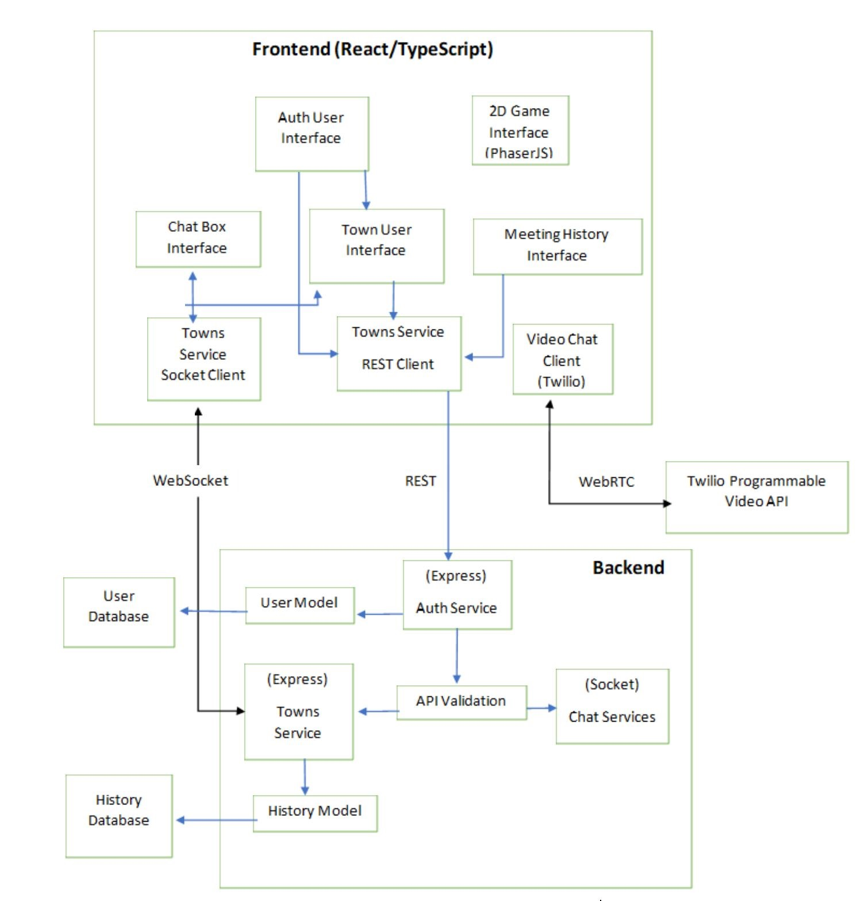

# Covey.Town
Git URL: https://github.com/vadlamani-s/covey.town/

App URL: https://fervent-hawking-007175.netlify.app/

Covey.Town provides a virtual meeting space where different groups of people can have simultaneous video calls, allowing participants to drift between different conversations, just like in real life.
Covey.Town was built for Northeastern's [Spring 2021 software engineering course](https://github.com/vadlamani-s/covey.town), and is designed to be reused across semesters.
You can view our reference deployment of the app at [app.covey.town](https://fervent-hawking-007175.netlify.app/).

The figure above depicts the high-level architecture of Covey.Town.
The frontend client (in the `frontend` directory of this repository) uses the [PhaserJS Game Library](https://phaser.io) to create a 2D game interface, using tilemaps and sprites.
The frontend implements video chat using the [Twilio Programmable Video](https://www.twilio.com/docs/video) API, and that aspect of the interface relies heavily on [Twilio's React Starter App](https://github.com/twilio/twilio-video-app-react).

A backend service (in the `services/roomService` directory) implements the application logic: tracking which "towns" are available to be joined, and the state of each of those towns.

## Running this app locally

Running the application locally entails running both the backend service and a frontend.

### Setting up the backend

To run the backend, you will need a Twilio account. Twilio provides new accounts with $15 of credit, which is more than enough to get started.
To create an account and configure your local environment:

1. Go to [Twilio](https://www.twilio.com/) and create an account. You do not need to provide a credit card to create a trial account.
2. Create an API key and secret (select "API Keys" on the left under "Settings")
3. Create a `.env` file in the `services/roomService` directory, setting the values as follows:

| Config Value            | Description                                      |
| ----------------------- | -------------------------------------------------|
| `TWILIO_ACCOUNT_SID`    | Visible on your twilio account dashboard.        |
| `TWILIO_API_KEY_SID`    | The SID of the new API key you created.          |
| `TWILIO_API_KEY_SECRET` | The secret for the API key you created.          |
| `TWILIO_API_AUTH_TOKEN` | Visible on your twilio account dashboard.        |
| `JWT_SECRET`            | Secret for Cookie Authentication.                |
| `UI_SERVER_ORIGIN`      | URL of the frontend server.                      |
| `MONGODB_URI`           | URL for connecting to DB with Mongo credentials. |

### Starting the backend

Once your backend is configured, you can start it by running `npm start` in the `services/roomService` directory (the first time you run it, you will also need to run `npm install`).
The backend will automatically restart if you change any of the files in the `services/roomService/src` directory.

### Configuring the frontend

Create a `.env` file in the `frontend` directory, with the line: `REACT_APP_TOWNS_SERVICE_URL=http://localhost:8081` (if you deploy the rooms/towns service to another location, put that location here instead)

### Running the frontend

In the `frontend` directory, run `npm start` (again, you'll need to run `npm install` the very first time). After several moments (or minutes, depending on the speed of your machine), a browser will open with the frontend running locally.
The frontend will automatically re-compile and reload in your browser if you change any files in the `frontend/src` directory.

### Setting up MongoDB

Create a MongoDB account. After login create a cluster by providing a valid name for the same. After that create a Database along with a collection name. Additonal collections can be added when required to the database. { Note: for this project 2 collections have been created for User detail storage and meeting history details of the players }.

The URI for the database can be obtained from the 'Connect tab' under Clusters details. Once the tab is clicked, the option to connect to your application has to be choosen. Use this URI for configuring the 'MONGODB_URI'. 

Note: Whitelist the network connection port to current IP address or '0.0.0.0/0' under network access tab.

### Setting up Netlify and Herouku
Please refer to the Activity 10.1 link mentioned below
https://neu-se.github.io/CS4530-CS5500-Spring-2021/Activities/continuous-development

Note: Apart from the config values mentioned in the Activity, add the above mentioned config variables in the git secrets and the main.yml file.

